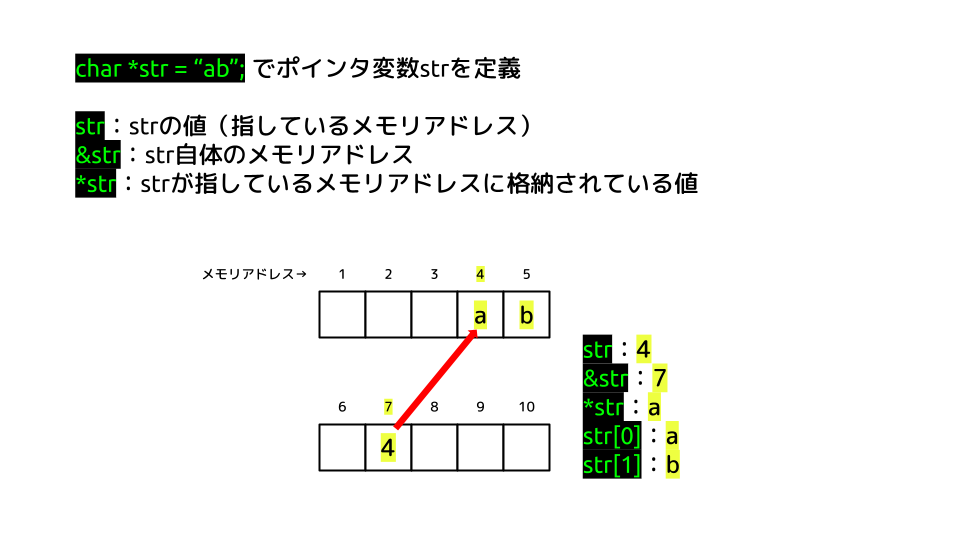

# socket-programming

## ポインタ



## 改行コード

下記のようにOSによって改行コードは異なるが、C言語の標準ライブラリではファイルを開くときにテキストモードとバイナリモードを指定することができ、テキストモードの場合は改行コードを`\n`に自動的に置換するのに対し、バイナリモードの場合はファイルの内容を一切変更せずにそのまま読み書きする。例えば`FILE *file = fopen("example.txt", "r");`とするとテキストモードでファイルを開き、`FILE *file = fopen("example.txt", "rb");`とするとバイナリモードでファイルを開く。標準入出力の場合はテキストモードしか使用することができない。そのため、`scanf`や`printf`を使うときは、テキストモードになる。

| OS | 名称 | エスケープ表記 |
| --- | --- | --- |
| Windows | CRLF | `\r\n` |
| Unix (Linux, macOS, FreeBSD) | LF | `\n` |
| 昔のMac | CR | `\r` |

## `scanf`

ユーザーが標準入力すると、入力バッファにデータが一旦格納される。`scanf`はこの入力バッファからデータを読み取り、変数に格納する。`scanf`は特に指定がなければ、入力バッファからデータを全て読み取るため、格納先の変数の容量以上のデータを入力すると、バッファオーバーフローが発生する。それを避けるためには、フォーマット指定子に最大文字数を指定する必要がある。例えば、`input[100]`としたとき、終端文字を除いて最大99文字まで読み取る場合は、`scanf("%99s", input);`とする。

`scanf`でよく使われる`%s`や`%d`というフォーマット指定子は、空白文字（空白、タブ、改行など）を区切りとしてデータを読み取る。なので例えばユーザーが`Alice 25`と入力した場合、`scanf("%s %d", name, &age);`で読み取ると、`name`には1が、`age`には25が格納される。そのため、例えば`%[^\n]`のようにして正規表現のように指定することで、空白文字を区切りとせずにデータを読み取ることができる。`%[^\n]`は改行文字以外の全ての文字を読み取るという意味である。そのため、例えば`Hello World\n`と入力すると、空白文字を含む`Hello World`が変数に格納される。

ユーザーは標準入力の最後にエンターキーを押すため、改行文字も入力バッファに入るが、`scanf`でよく使われる`%s`や`%d`というフォーマット指定子は、前述したように空白文字を区切りとしてデータを読み取るため、改行文字は読みとられず、入力バッファに残ることになり、予期せぬ動作を引き起こすことがある。そのため、`scanf`の後に入力バッファに残っている改行文字を`getchar`で読み取り、捨てることが一般的である。

下記は`%c`を使って1文字だけ読み取る例である。`%c`は空白文字も読み取るため、改行文字を読み取ることができる。そのため、`a\n`と入力すると、最初に`a`が表示され、次に入力バッファに残っている改行文字が表示される。

```c
int main() {
  char input;
  while (1) {
    printf("shell> ");
    scanf("%c", &input);
    printf("%c\n", input);
  }
}
```

```sh
shell> a
a
shell> 

shell> 
```

[[迷信] scanfではバッファオーバーランを防げない](https://www.kijineko.co.jp/迷信-scanfではバッファオーバーランを防げない/)

[C言語の標準入力関数をまとめてみた　～①scanf,getchar,gets～](https://ameblo.jp/koshi-8-ginchaku/entry-12252499746.html)

## `htons`

"Host TO Network Short" の略で、16ビットの整数（short型）をホストバイトオーダー（通常はリトルエンディアン）をネットワークバイトオーダー（ビッグエンディアン）に変換するための関数である。`htons(PORT)`はポート番号をネットワークバイトオーダーに変換する。

## Socketオプション

Closeしたポートは、`TIME_WAIT`状態になり、数分間そのポートを再利用することができない。すぐに再利用してしまうと、以前のコネクションの時に送られてきたパケットが新しいコネクションに届いて、混入する可能性があるためである。そのため、`TIME_WAIT`状態のポートにソケットをバインドしようとすると`Address already in use`というエラーが発生する。

`setsockopt`でソケットオプションを設定することができる。ソケットオプションは、ソケットの動作を制御するためのパラメータである。`setsockopt`の第2引数にはオプションのレベルを指定する。`SOL_SOCKET`はソケットレベルのオプションで、`IPPROTO_TCP`はTCPレベルのオプションである。第3引数にはオプション名を指定する。`SO_REUSEADDR`を設定するとソケットを`TIME_WAIT`状態のポートにバインドできるようになる。第4引数にはオプションの値を指定する。第5引数にはオプションの値のサイズを指定する。

あまり行儀が良くないように見えるが、そもそも前のコネクションのパケットが混じるということはあまり起こることではないのと、混ざったとしても今のコネクションのものではないパケットを検出して捨ててあげれば良いだけなので、特に問題はない。それを言うとそもそもTIME_WAIT自体も苦肉の策であって完全な解決策ではない。

ちなみに`SO_REUSEPORT`を設定すると、同じポート番号に複数のソケットをバインドできるようになる。例えば複数のサーバープロセスが同一ポートで待ち受けることで分散処理などが可能になる。

```c
// Socket Option
int opt = 1;
if (setsockopt(ss, SOL_SOCKET, SO_REUSEPORT, &opt, sizeof(opt)) == -1) {
  perror("setsockopt SO_REUSEPORT failed");
  close(ss);
  return 1;
}
```

[ソケットプログラミング - 東京大学](https://i1i2i3.eidos.ic.i.u-tokyo.ac.jp/slides/socket.pdf)

[分散にも便利 SO_REUSEPORT](https://chienomi.org/articles/linux/202212-reuseport.htmls)

[NginxでのeBPFとSO_REUSEPORTを使ったQUICコネクション受信処理](https://medium.com/nttlabs/nginx-quic-ebpf-soreuseport-127c62112a8d)

## `sin_addr`

下記のようにするとサーバーが任意のネットワークインターフェース（すべての利用可能なインターフェース）からの接続を受け入れるという意味になる（具体的には、`0.0.0.0`というアドレスに解決される）。

```c
addr.sin_addr.s_addr = INADDR_ANY;
```

下記のようにすると、ローカルホスト（`127.0.0.1`）からの接続のみを受け入れるという意味になる。

```c
if (inet_aton("127.0.0.1", &addr.sin_addr) == 0) {
  perror("invalid address");
  close(ss);
  return -1;
}
```

## `send_all`、`recv_all`

デバイスドライバのバッファやカーネルのバッファの容量に余裕がなければ指定しただけのバイトを送れないor受け取れないので確実に指定しただけのサイズを送信/受信できるようにする。
