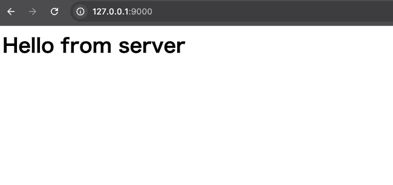

# ソケットプログラミング

## 概要

C言語でソケットプログラミングを行った。クライアント・サーバー間はTCPで通信している。シェル、`wget`コマンド、HTTPサーバーを実装しており、簡単にだが、HTTPを喋ることができる。

### Future Work

- [ ] スレッドを使ってデータのやり取りが多くなるように高速化を行う
- [ ] サーバーが特定のシグナルを受け取ったら停止するようにする

## 環境構築

コンパイル：

```bash
make
```

サーバーの起動：

```bash
$ server/server.out
server starting...
listening on port 9000
```

シェル（クライアント）の起動：

```bash
$ client/shell.out
shell> 
```

## 使い方

### クライアント

サーバーとシェルを起動した後、シェルで下記のように実行するとサーバーにGETリクエストを送ることができる。

```bash
shell> wget 127.0.0.1:9000

HTTP/1.1 200 OK
Content-Type: text/html
Connection: close

<html><body><h1>Hello from server</h1></body></html>


shell>
```

また外部のサイトに対してもリクエストを送ることができる（HTTPのみ、パス指定は未対応）。

```bash
shell> wget 93.184.215.14:80

HTTP/1.1 404 Not Found
Content-Type: text/html
Date: Sun, 29 Sep 2024 09:51:53 GMT
Server: ECAcc (lac/55D2)
Content-Length: 345
Connection: close

<?xml version="1.0" encoding="iso-8859-1"?>
<!DOCTYPE html PUBLIC "-//W3C//DTD XHTML 1.0 Transitional//EN"
         "http://www.w3.org/TR/xhtml1/DTD/xhtml1-transitional.dtd">
<html xmlns="http://www.w3.org/1999/xhtml" xml:lang="en" lang="en">
        <head>
                <title>404 - Not Found</title>
        </head>
        <body>
                <h1>404 - Not Found</h1>
        </body>
</html>

shell> 
```

### サーバー

サーバーはブラウザからもアクセスできる。


